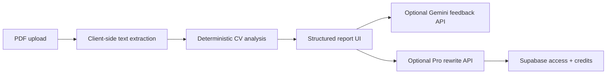

# HireReady CV

[Live application](https://hireready-cv-final.vercel.app) · [Report an issue](https://github.com/Ahmad-Joker/hireready-cv-final/issues)

HireReady CV is a CV and ATS review product for early-career applicants in Egypt and the UK. It extracts text from a PDF in the browser, produces a deterministic rule-based review, compares the CV with a target role or job description, and can add guarded Gemini feedback when the server is configured.

> **Status:** Active portfolio project and primary HireReady repository. The earlier `hireready-cv` repository is a legacy prototype.

## Problem and solution

Generic CV advice is difficult to act on and may not match a candidate's market or target role. HireReady turns an uploaded CV into a structured report with explainable scoring, section checks, keyword gaps, prioritized improvements, and optional AI-assisted feedback. Deterministic checks remain available even when the AI integration is not configured.

## What is implemented

- Client-side PDF text extraction with PDF.js.
- Rule-based ATS, structure, impact, readability, and keyword scoring.
- Job-description keyword comparison and an ordered improvement plan.
- Country and experience-level context for Egypt and UK applications.
- Server-side Gemini feedback with bounded inputs and normalized JSON output.
- Pro rewrite flow with Supabase-backed access-code and credit checks.
- Supabase-backed waitlist endpoint.
- Responsive Next.js interface deployed on Vercel.

## Architecture



The base report is generated locally from extracted text. Gemini and Supabase credentials remain server-side in Next.js route handlers.

## Technology stack

- **Frontend:** Next.js 16, React 19, JavaScript, Tailwind CSS
- **Document processing:** PDF.js, `docx`
- **AI:** Google Gemini API
- **Data:** Supabase
- **Delivery:** Vercel

## Run locally

Requirements: Node.js 20+ and npm.

```bash
git clone https://github.com/Ahmad-Joker/hireready-cv-final.git
cd hireready-cv-final
npm ci
cp .env.example .env.local
npm run dev
```

Open [http://localhost:3000](http://localhost:3000).

On Windows PowerShell, replace the copy command with:

```powershell
Copy-Item .env.example .env.local
```

## Environment configuration

| Variable | Required | Purpose |
| --- | --- | --- |
| `GEMINI_API_KEY` | Optional | Enables AI feedback and CV rewriting |
| `SUPABASE_URL` | Optional | Supabase project URL for waitlist and Pro access |
| `SUPABASE_SERVICE_ROLE_KEY` | Optional | Server-only key for protected Supabase operations |

Never expose `SUPABASE_SERVICE_ROLE_KEY` through a `NEXT_PUBLIC_` variable.

## Verification

```bash
npm run build
npm audit
```

The current production build compiles successfully on Next.js 16.3.6 and the dependency audit reports zero known vulnerabilities as of 25 September 2026.

## Privacy and responsible AI

- PDF text extraction runs in the browser for the base analysis.
- AI feedback is sent only when the user requests an AI-powered feature.
- Prompts tell the model not to invent candidate facts and outputs are normalized before display.
- Users should verify every generated rewrite before applying with it.

## Limitations

- ATS scoring is a transparent heuristic, not a guarantee of recruiter or ATS outcomes.
- Scanned PDFs without a text layer may not extract correctly.
- AI and Pro features require private server-side environment configuration.
- Automated application tests are not included yet; the production build is the current repeatable verification step.

## Project status

The deployed MVP is usable and under active iteration. Planned improvements include automated tests, clearer data-retention messaging, stronger abuse controls for public API routes, and expanded accessibility checks.
